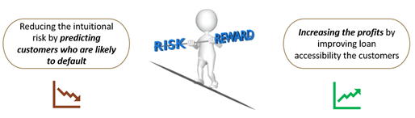
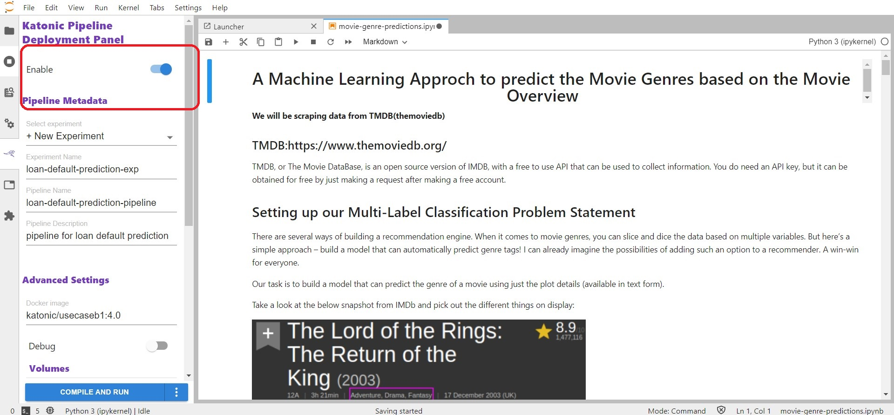
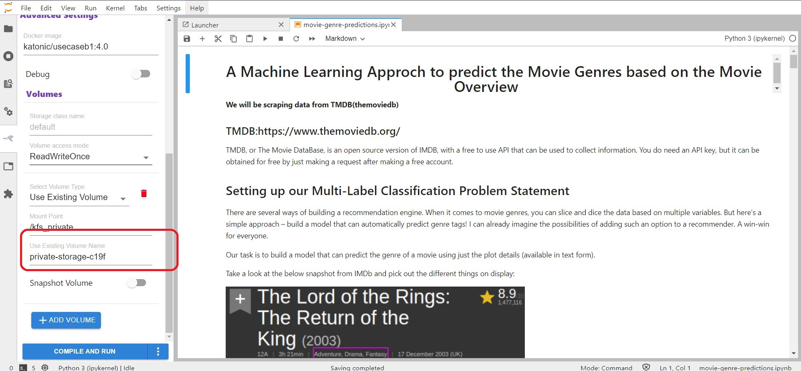
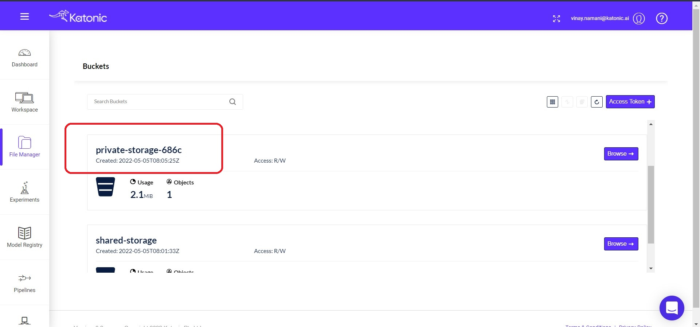

# Bank Loan Default Prediction

Bank loan default is a classic use case where ML models can be deployed to predict risky customers and hence minimize losses of the lenders. Financial industry is highly regulated, thus any model deployed or classification of customers basis their behavior, demographics etc. is highly regulated and must be explained to authorities to ensure unbiased operations.

Loans are risky but at the same time it is also a product that generates profits for the institution through differential borrowing/ lending rates.

The ML model should be explainable and be able to balance between risk and profits.

# How to run the Pipeline Notebook.

* Click on Katonic Pipeline Deployment Panel from the Left sidebar and Enable it.

* Here you are able to edit all the pre-defined settings and configurations, but in order to run the Pipeline inside your workspace, you need to change one parameter `Use Existing Volume Name` with your Private storage ID which you can find inside the File-Manager.

* You can find the Private storage ID from the File-Manager.

After replacing the existing volume id with your private storage ID. Then click on the Compile and Run option from below. 

You can see that the pipeline is in running mode.

# How to run the App.

* Clone this repository to your local system or any other project workspace.
* Then create a repository in your Personal profile inside the GitHub.
* Copy the files the are available inside this app folder [app folder link](https://github.com/katonic-dev/Katonic-ML-Marketplace/tree/master/Movie_Genre_Prediction_App/app) to your repository.

Once you have all the Application files into your Personal repository, Follow this [documentaion](https://docs.katonic.ai/Getting-started-with-featured-store/app_deployment) to deploy an application.
